

  

_______________

# 
SingulierPluriel LMS

[About](#about)  |  [Background](#background)  |  [UX Design](#UX)  |  [Web Development](#WD)  |  [Data Science](#DS)  |  [Next Steps](#next-steps)  |  [Authors](#authors)

## About
**SingulierPluriel LMS** is a learning management system for universities and adult education settings, designed to be accessible, intuitive, and easy to navigate. Main features include:

- Share learning materials with your students by creating and editing course modules;
- Graphical dashboards: the LMS allows you to always have crucial data like student attendance, student feedback, and grade distribution at your fingertips, in the form of graphics and visual representations.

## Background
Most learning management systems (LMS) used in university and adult education settings are by now fairly old and present counterintuitive UIs with too many redundant categories and an unclear navigation experience. A lot of them look something like this…

  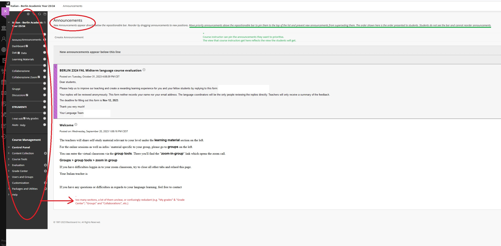

… as you can see, an overabundance of sections with ambiguous and redundant labeling can easily confuse users, and even completing a simple task like uploading course materials or evaluating assignments can turn into a long-winded and confusing process.

With **SingulierPluriel LMS**, we are creating an LMS that trims superfluous categories, allows for speedy navigation and flow, assists users in performing their tasks quickly and efficiently, and allows course instructors to visualize important info on their courses graphically and intuitively. 

Our final team composition was as follows:
- **Dewa Baedaar / Magdalena Olkiewicz / Malalai Afghansafi / Nicol Tincani** (WD)
- **Leila Kulik / Lucas Winterfeld** (DS)
- **Giorgio Chiappa** (UX)
- **Matheus Albuquerque** (mentor)

> - [Mid-Term Presentation](https://docs.google.com/presentation/d/12LzRMYXcvgJOYVA-vm3dMvLlVjHzbcVmvCHeCJjTs4E/edit?usp=sharing)
> - [Final presentation](https://docs.google.com/presentation/d/1hp2iBSedUYOAdF_X1kS7nHHj2R5ncAivJmjWb7cxIHI/edit#slide=id.g2c98a01c2f0_2_75)

## UX Design

### Research
Our UX team (/person) began by performing a thorough competitor analysis, reviewing a variety of existing LMS. He was already familiar with some of those due to his job as a course instructor in universities and language schools, but he also examined further examples from the competition (Blackboard, Canvas, Google Classroom…). Aside from registering the problems that were already addressed here (ambiguous labeling, unclear functions and sections, cumbersome IA etc.), he also took note of the things that did work in the competition, e.g. the prominent presence of a help function in Canvas or the agile UI of Google Classroom.

UX then set out to poll course instructors and students regarding their experience with existing LMS via Google Surveys that he distributed in his network of colleagues and students. Student turnout was - somewhat surprisingly - much higher than the course instructor’s. The student surveys were also somewhat puzzling because an overall good rate of satisfaction with the existing LMS (Blackboard, in this case) was contradicted by a flurry of criticism in the sections that allowed for open comment. Both the student and teacher surveys, anyway, confirmed the pain points that UX had established in the competitive benchmark, and also offered precious insight into the desiderata that the users had: aside from clearer and snappier navigation, many users wished (amongst other things) for a more modern and intuitive design, quicker upload of course materials, and the possibility to visualize an image preview for the materials they had uploaded.

Based on these responses, UX generated three distinct user persona — 2 for course instructors, 1 for a student user. The two course instructor personas differed in age and tech capabilities, which also meant that they had different goals with the LMS (the less tech-savvy one just wanted to use it as a directory for course materials, the more technically versed one wanted to use it to have an interesting digital extension to their classroom environment). UX accordingly generated scenarios and user stories to match these personas.

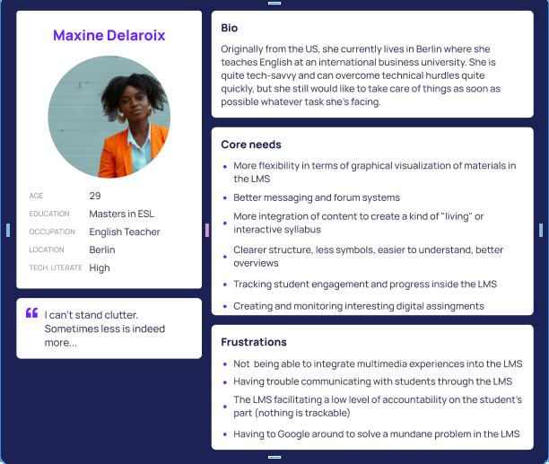  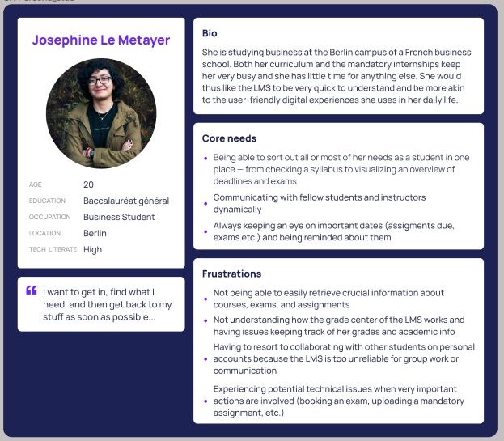

Finally, UX set out to boil down the categories of the SingulierPluriel LMS to 4 possible sections (Courses, Communication, Announcements, Grades Center) and to conduct card-sorting interviews using a tool called Optimal Workshop. Users were asked to place a variety of possible tasks connected to the LMS (e.g. upload an assignment, schedule an exam etc.) into those 4 categories.

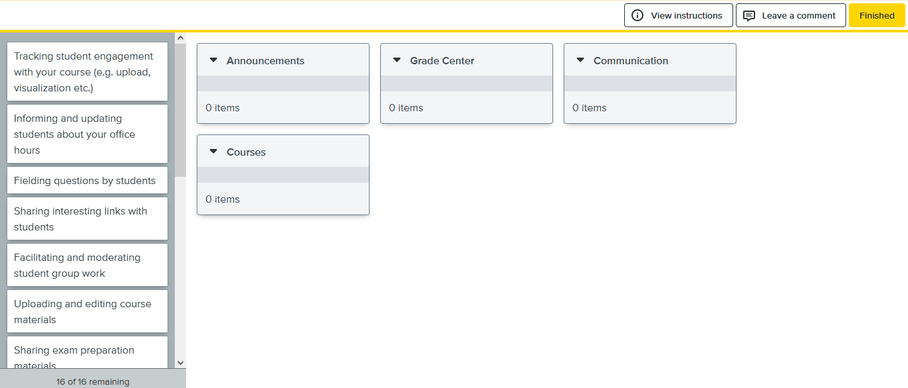

One important insight garnered from these card-sorting interviews was that the split between Communication and Announcements tended to create the most confusion, so we decided to fuse them into a single section.

### Designing SingulierPluriel LMS

UX then set out to generate a user flow for the main user we had in mind (the course instructor) performing a very mundane action inside of an LMS: creating a module in which to upload course materials.

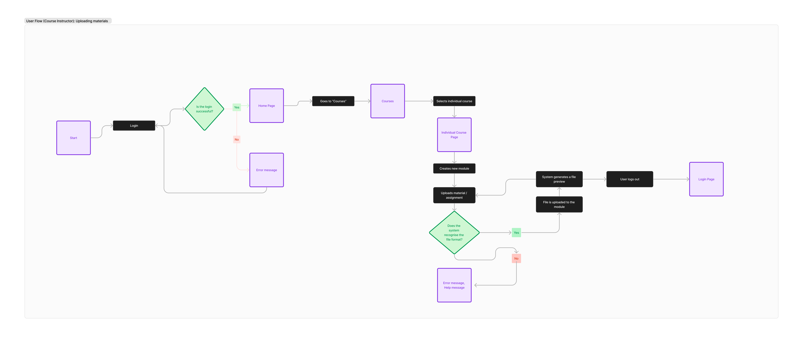

User flows like this helped UX in kickstarting the design process. During the early phases of designing the app, one major gripe was settling on a common UI library with WD, so that the components generated by UX in Figma would be easily consumable by developers. We settled on Chakra UI, and we did some testing by creating some samples and passing them back and forth between UX and WD in order to see how we could work together with the Chakra component library.

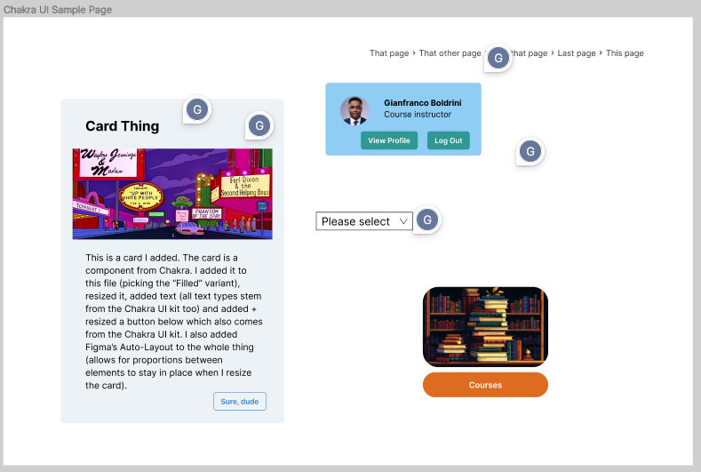

… all of this testing did not necessarily prepare us for all the roadblocks that WD would face while trying to recreate the UI on their end, but it did speed things up a bit and through the Chakra plugin for Figma (which is sadly not free…) UX found out he could also generate some code with info about color, width, height etc. that could be useful for the devs.

Anyway, through the design journey, we managed to go from the very first (admittedly appaling) hand-drawn wireframe sketches…

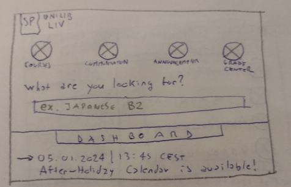

… to some early low fidelity wireframes…

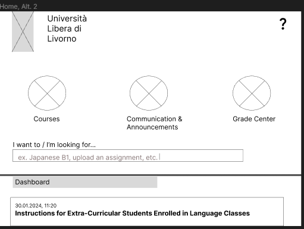

… then onto a mid-fi version of the designs…

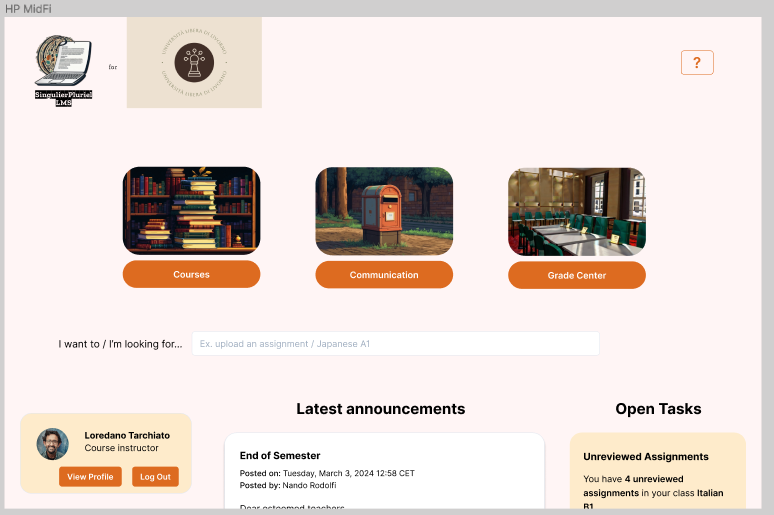

… and lastly - after creating a proper stylesheet, making some graphical adjustments, and making sure that colour contrast was more accessibility-friendly - we put together our high-fidelity Figma prototype.

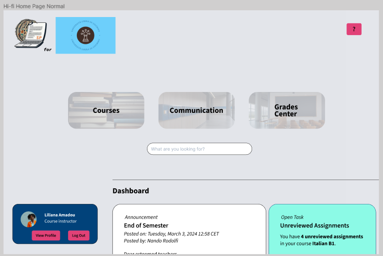

Here you can see our prototype in action - including a dynamic help function that allows one to take a journey through the functionalities of each page. Please note that the Figma prototype only includes the Course Instructor side, whereas the app developed by WD has two main roles, Course Instructor and Student.

<video src="./UX/Blogpost_Images/VIDEO.mp4" width="450" height="300" controls><video>

You can also test our high-fidelity Figma prototype here: [https://www.figma.com/proto/dfZykUktjrsipShxE2xHRv/Screwaround-File?type=design&node-id=1162-1904&t=eArMoH8ZFlA4ilZs-1&scaling=scale-down&page-id=1153%3A1903&starting-point-node-id=1162%3A1904&hotspot-hints=0&mode=design](https://www.figma.com/proto/dfZykUktjrsipShxE2xHRv/Screwaround-File?type=design&node-id=1162-1904&t=eArMoH8ZFlA4ilZs-1&scaling=scale-down&page-id=1153%3A1903&starting-point-node-id=1162%3A1904&hotspot-hints=0&mode=design)

### User Testing

<video src="./UX/Blogpost_Images/img_12.PNG" width="450" height="300" controls><video>

Lastly, UX administered a battery of user tests, asking potential users (all of whom are professionally active as lecturers or teachers) to perform tasks inside of the high-fidelity prototype while thinking aloud about what they were doing. These interviews have already provided a variety of alleyways we could take moving forward, e.g. streamlining things like the close buttons across the app to allow for more internal UI coherence; creating a skippable tutorial that opens up the first time a user logs into the LMS; offering an easy language option / accessibility mode with more visual cues, etc.

But most users showed a lot of enthusiasm and interest, remarking that SingulierPluriel seems way more accessible and immediate than what they are used to. They were also quite interested into the graphical dashboard functionality allowing to visualise data about a course (student attendance, performance, feedback etc.), which was the DS contribution to our project.

### UX Tech Stack
Figma for designing, Chakra UI kit to obtain ready-made components that are easily consumable by WD (though these components had to be largely modified by me to be of any use or interest at all…), Optimal Workshop for conducting card sorting interviews, Typescale for scaling fonts and typefaces.

## Web Development
We developed a dynamic Web App complete with client-server configuration and main CRUD operations. The frontend is organized into pages and components, along with other main app files.

**Key Features (Operational):**
- Login page
- Main dashboard
- Help center ('?')
- Courses page (fetching user courses from the backend)
- Detailed course page (accessible from course cards) with modules and course materials (data sourced from the backend)
- Module functionalities: Add, Edit, Delete Module; Delete course materials; Upload/Download options
- Logout capability

**User Roles:**
- Distinct roles for course instructors and students, with components conditionally rendered based on the user's role.

**Tools and Resources:**
- **Project Management:** Our team used Trello for task management, accessible [here](https://trello.com/b/MuXdeIPG/singulierpluriel-lms).
- **Board:** Check our Miro board [here](https://miro.com/app/board/uXjVNrj3AzQ=/).
- **Tech Stack:** The app was built using HTML, CSS, JavaScript, React, Chakra UI, Node.js, Express, MongoDB, Render, and Cloudinary.
- **Documentation:** A detailed list of libraries and technologies used is available [here](https://docs.google.com/document/d/1h4APpcQqYx4kJHqJv2mmVjjXRcIP-ceMvADlGp6LJng/edit#heading=h.g7bk7pcwop6a).

**Features which are currently in demo phase:**
- Search bar
- Announcements on the main page
- Communication
- Grade Center
- On specific course pages - buttons: Add Link, Add Multimedia, Check/Edit Assignments.

### App Demo
<video src="https://www.loom.com/share/5e36b0dedfca4ed7a3950646202ac521?sid=cc489221-9c77-4ae2-a61d-1042a4ddc5b1" width="400" height="250" controls><video>

### Backend
The Singulier-Pluriel App is served by a RESTful backend developed with Node.js and Express framework. The server is connected to the database managed in MongoDB Atlas via mongoose. For image/file uploads the online storage Cloudinary has been configured and connected to the server as well as the DB to upload/delete cloud-stored files accordingly.

These tools were chosen to enhance practice on the technical stack learned during  the academic phase in the edyoutcated course for BE.

#### Server/API - Node.js and Express
The "server.js" file contains the main code to start the server. The functions of the endpoints are to be found in the "controllers" folder and are then imported accordingly to the specific routes (in the "routes" folder) referenced in the main code.
The "middleware.js" and "utils.js" files contain other helper functions and perform specific actions, some of them "functional" (see "middleware.js"), like checking if the user is logged in or has a certain role, others with more of a "technical" purpose (see "utils.js", to remove repetition of try & catch method in async functions).

> Express API documentation: [https://documenter.getpostman.com/view/32234784/2sA358eko7](https://documenter.getpostman.com/view/32234784/2sA358eko7)

> **Note on endpoints**: Due to changes of plan and reprioritization according to the FE techies' availabilities, some endpoints are not actively used in the delivered version of the app. See for example "Activate account", "Get course students", "Create course", "Toggle publish course".

In order to make the work of BE & FE more flexible, the server has been deployed online on [Render](https://render.com/) at the URL [https://ws24-singulier-pluriel.onrender.com](https://ws24-singulier-pluriel.onrender.com).

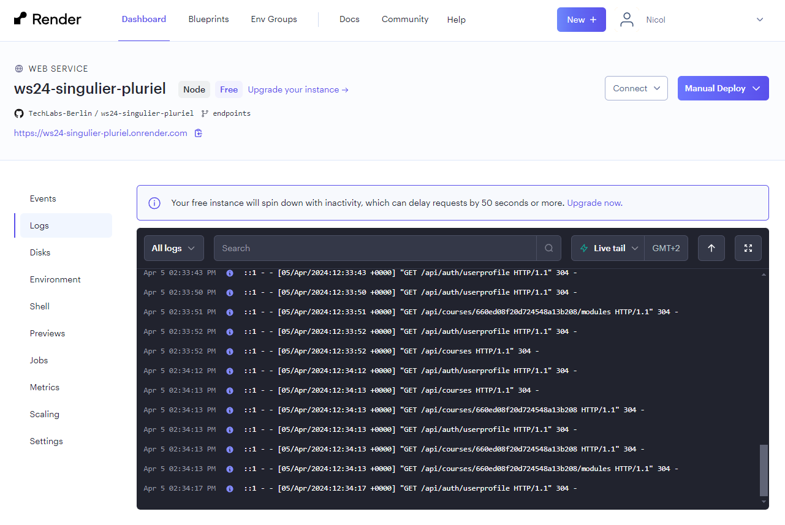

> **Note on Render**: Due to the limitation of the free tier, the server might take some time to process requests after a longer periods of inactivity. The processing time will improve with usage. 

#### Database - MongoDB Atlas, mongoose and DB models
The server is connected to MongoDB Atlas as a tool to store the app data according to the schemas/models that can be found in the 'db' folder. The content has been populated programmatically via the DB seeding script.

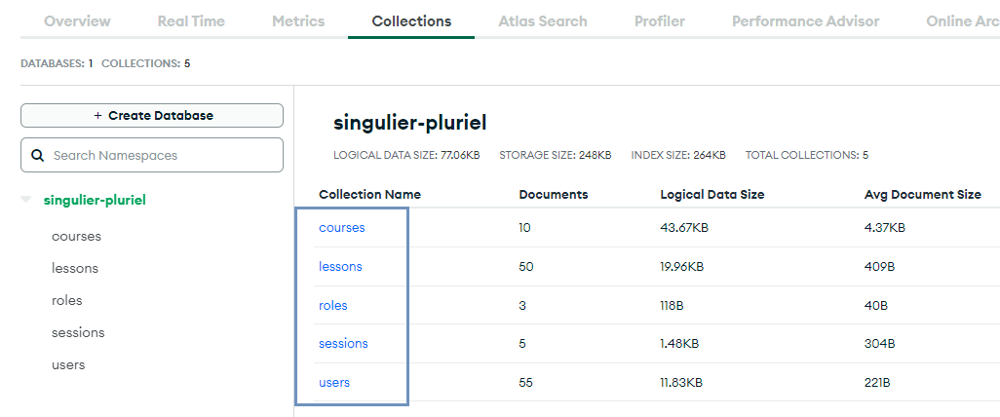

The main collections/models (roles, users, courses, lessons) present both One-to-One and One-to-Many relationships (with embedded documents and document reference).

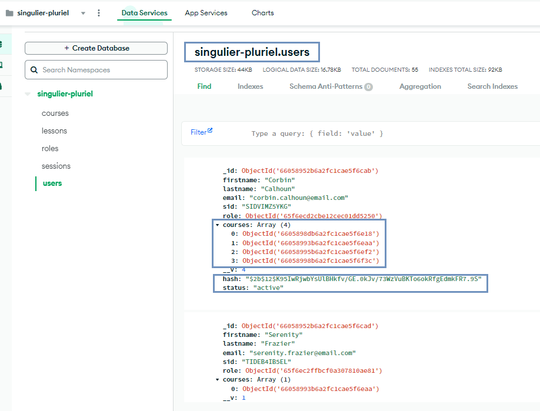 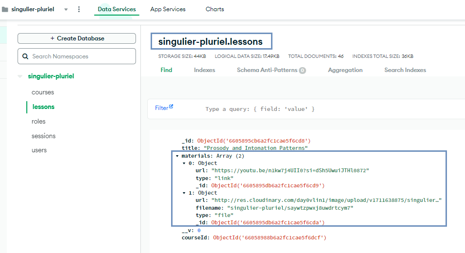

The "courses" collection presents a category called "stats" that holds (randomly generated) data based on the DS goals on how to represent students-related data/participation/feedback in graphical dashboards. This data was included in the app for future purposes, but it is currently not actively used in the app.

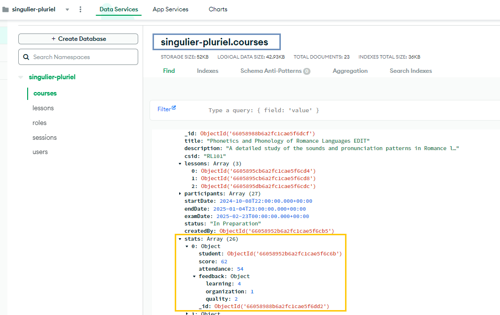

The additional collection "sessions" will be created and used to store the users' session information. This way the server can 'locate' the origin of the request and retrieve the data related to the currently logged in user.

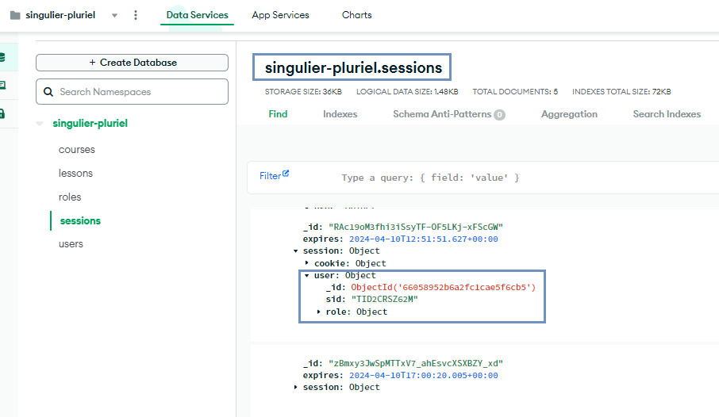

The database connection is created separately in the 'dbConnect.js' file, which is then imported and run directly in the 'server.js' file.

##### DB seeding
The 'seed' folder contains data on users, courses, modules and files that will be programmatically (see 'new_seed.js') combined together to create new DB documents and accordingly feed the specific collections. The script first wipes the database clean, then feeds the collections from scratch.

#### Cloud Storage - Cloudinary
Cloudinary was chosen as cloud storage for collecting course covers and any material uploaded to a specific module. The accepted formats are image files (jpg, jpeg, png) and PDF. MS Office files and any other text files are not supported without additional plug-ins.
The file upload/deletion is made possible with the combination of the 'cloudinary' library and a middleware from the 'multer' library, which performs the upload to a specific Cloudinary folder ('singulier-pluriel'). Key information of the file request object (filename, url) made available by 'multer' is stored in the specific category of the corresponding DB document.

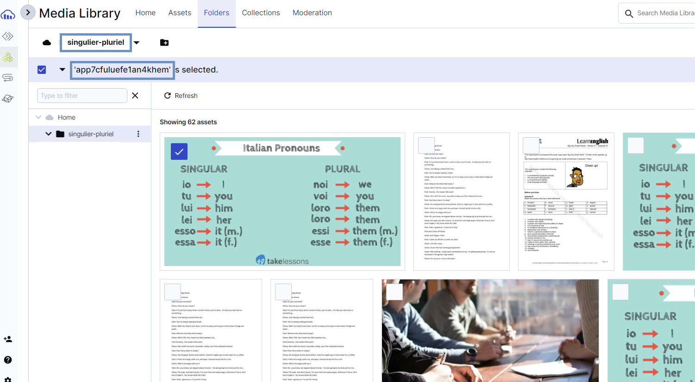 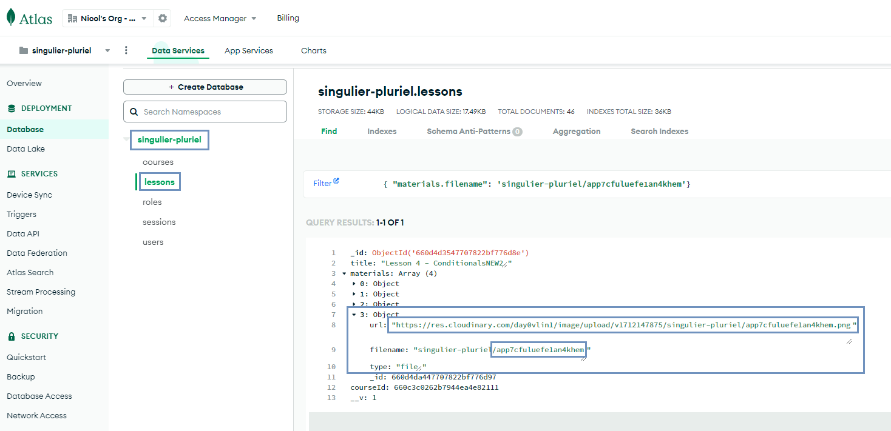

## Data Science

1) Graphical dashboard designed for teachers that is build with python using the flask framework. The dashboard under development is featuring two levels: **general** and **course-specific**. 

The **general level** includes aggregate statistics about courses, grades and student results.
The **course level** includes three key features with graphical representation.

- The first feature is attendance tracking, which allows teachers to monitor student attendance in both classes and online sessions, making it easier to identify patterns and follow up with absent students (**Attendance Distribution (course level)**)
- The second feature is feedback distribution, enabling teachers to adjust and modify course plans based on student feedback (**Feedback Distribution (course level)**)
- The third feature is performance tracking, providing insights into student progress within a specific course, including detailed grade distribution (**Grade Distribution (course level)**)
- An example of how these three features can be integrated into the system using Flask can be found in the subfolder "**Example Flask Integration Attendance Feature**", which demonstrates the integration using student attendance as an example

2) Two machine learning algorithms: one predicts student feedback (**Student Feedback prediction (ML)**) to help teachers customize course content even before the course begins and save teachers time and effort that would have otherwise been spent manually reviewing data; the other algorithm (**Performance Prediction (ML)**) predicts performance to assist in identifying at-risk students, improving teaching strategies, and pinpointing student learning preferences, strengths, and weaknesses.

## Next Steps
* Work on other pages/features (for ex., add course announcements and grades center to dashboard, add a more interactive Help function, add assignments to modules)
* Implementing live data tracking for seamless integration with the DS data/models + stats update
* Implementing in-app notifications and messaging (for announcements and for reminders)
* Improve students' experience (for ex. add exam booking, enhance interaction with modules and materials)
* Interactive help function
* Implement responsive design

## Authors
This project was created by:

* User Experience: Giorgio Chiappa
* Data Science: Leila Kulik
* Data Science: Lucas Winterfeld
* Wed Developer (FE): Magdalena Olkiewicz 
* Wed Developer (FE): Malalai Safi
* Wed Developer (FE): Dewa Baedaar
* Wed Developer (BE): Nicol Tincani
  
Mentor: Matheus Albuquerque
