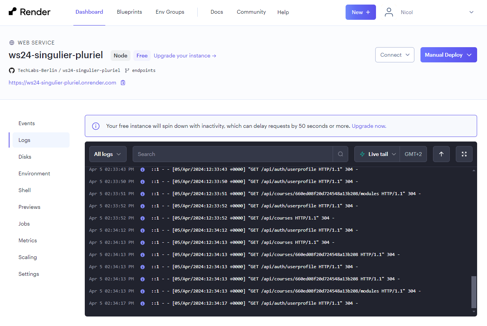
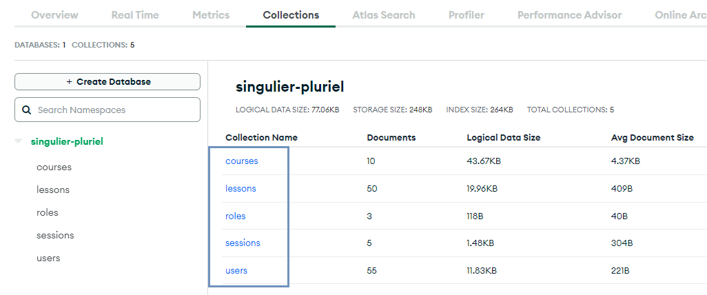
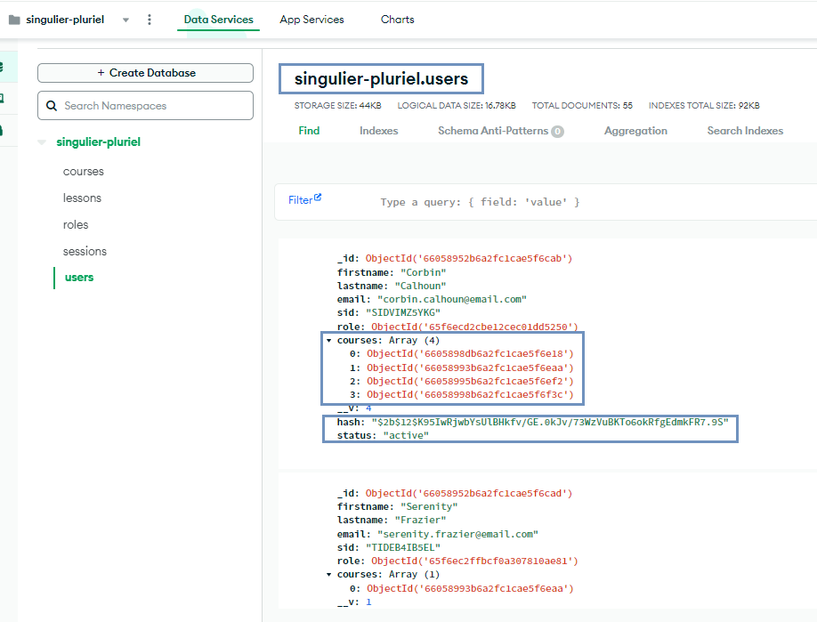
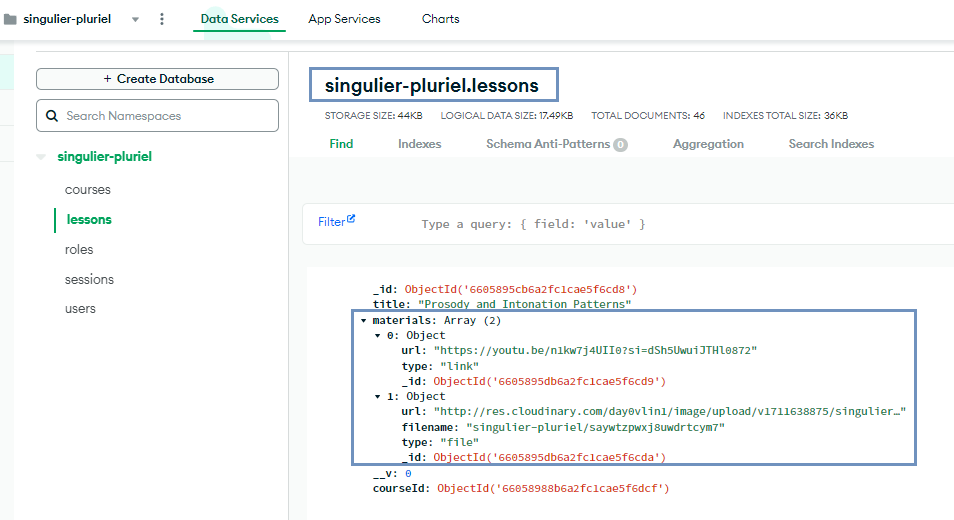
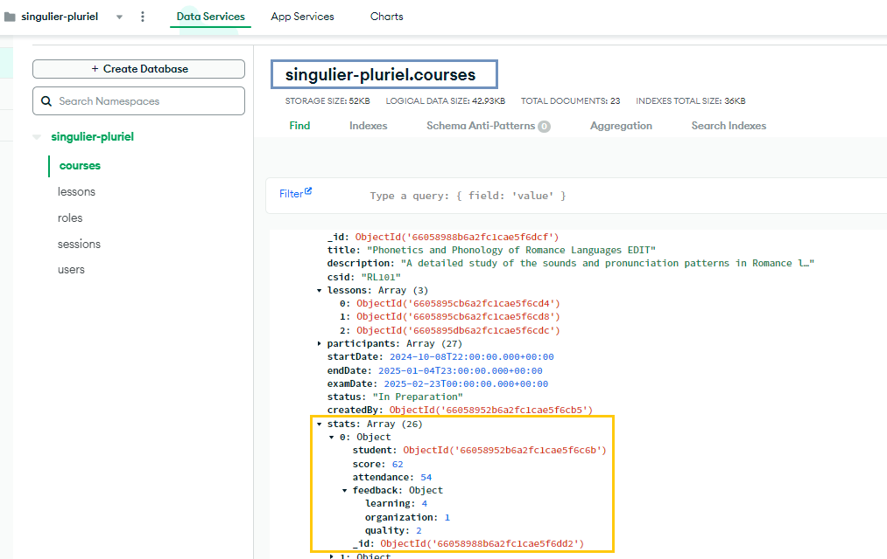
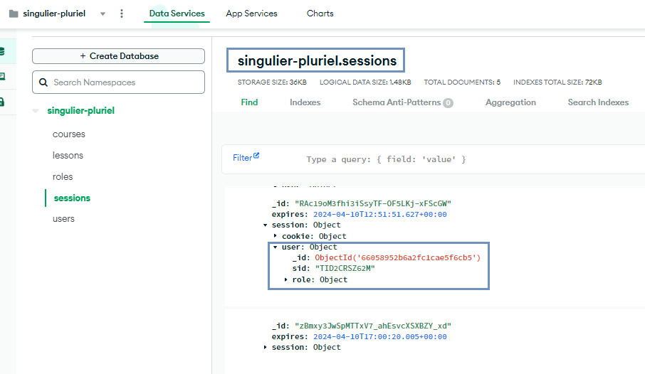
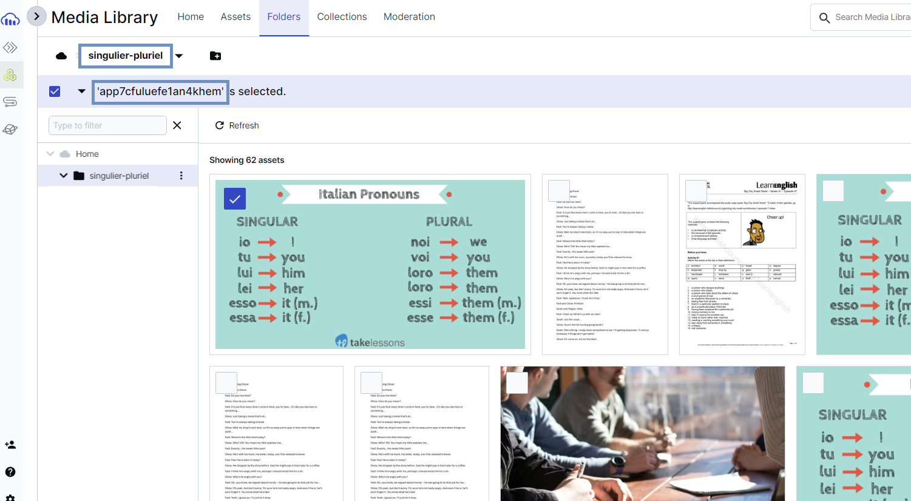
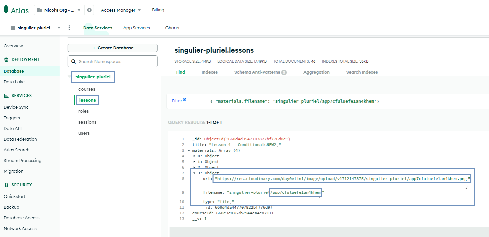

## Backend
The Singulier-Pluriel App is served by a RESTful backend developed with Node.js and Express framework.
The server is connected to the database managed in MongoDB Atlas via mongoose.
For image/file uploads the online storage Cloudinary has been configured and connected to the server as well as the DB to upload/delete cloud-stored files accordingly.

### Server/API - Node.js and Express
The "server.js" file contains the main code to start the server. The functions of the endpoints are to be found in the "controllers" folder and are then imported accordingly to the specific routes (in the "routes" folder) referenced in the main code.
The "middleware.js" and "utils.js" files contain other helper functions and perform specific actions, some of them "functional" (see "middleware.js"), like checking if the user is logged in or has a certain role, others with more of a "technical" purpose (see "utils.js", to remove repetition of try & catch method in async functions).

> Express API documentation: [https://documenter.getpostman.com/view/32234784/2sA358eko7](https://documenter.getpostman.com/view/32234784/2sA358eko7)

> **Note on endpoints**: Due to changes of plan and reprioritization according to the FE techies' availabilities, some endpoints are not actively used in the delivered version of the app. See for example "Activate account", "Get course students", "Create course", "Toggle publish course".

In order to make the work of BE & FE more flexible, the server has been deployed online on [Render](https://render.com/) at the URL [https://ws24-singulier-pluriel.onrender.com](https://ws24-singulier-pluriel.onrender.com).

> **Note on Render**: Due to the limitation of the free tier, the server might take some time to process requests after a longer periods of inactivity. The processing time will improve with usage. 

### Database - MongoDB Atlas, mongoose and DB models
The server is connected to MongoDB Atlas as a tool to store the app data according to the schemas/models that can be found in the 'db' folder. The content has been populated programmatically via the DB seeding script.

The main collections/models (roles, users, courses, lessons) present both One-to-One and One-to-Many relationships (with embedded documents and document reference).

The "courses" collection presents a category called "stats" that holds (randomly generated) data based on the DS goals on how to represent students-related data/participation/feedback in graphical dashboards. This data was included in the app for future purposes, but it is currently not actively used in the app.

The additional collection "sessions" will be created and used to store the users' session information. This way the server can 'locate' the origin of the request and retrieve the data related to the currently logged in user.

The database connection is created separately in the 'dbConnect.js' file, which is then imported and run directly in the 'server.js' file.

#### DB seeding
The 'seed' folder contains data on users, courses, modules and files that will be programmatically (see 'new_seed.js') combined together to create new DB documents and accordingly feed the specific collections. The script first wipes the database clean (apart from the 'roles' collection) and feeds collections from scratch.

### Cloud Storage - Cloudinary
Cloudinary was chosen as cloud storage for collecting course covers and any material uploaded to a specific module. The accepted formats are image files (jpg, jpeg, png) and PDF. MS Office files and any other text files are not supported without additional plug-ins.
The file upload/deletion is made possible with the combination of the 'cloudinary' library and a middleware from the 'multer' library, which performs the upload to a specific Cloudinary folder ('singulier-pluriel'). Key information of the file request object (filename, url) made available by 'multer' is stored in the specific category of the corresponding DB document.

## Next Steps
* Work on other pages/features (for ex., add course announcements and grades center to dashboard, add a more interactive Help function, add assignments to modules)
* Implementing live data tracking for seamless integration with the DS data/models + stats update
* Implementing in-app notifications (for announcements and for reminders)
* Improve students' experience (for ex. add exam booking, enhance interaction with modules and materials)

## Authors
This project was created by:

* User Experience: Giorgio Chiappa
* Data Science: Leila Kulik
* Data Science: Lucas Winterfeld
* Wed Developer (FE): Magdalena Olkiewicz 
* Wed Developer (FE): Malalai Safi
* Wed Developer (FE): Dewa Baedaar
* Wed Developer (BE): Nicol Tincani
  
Mentor: Matheus Albuquerque
